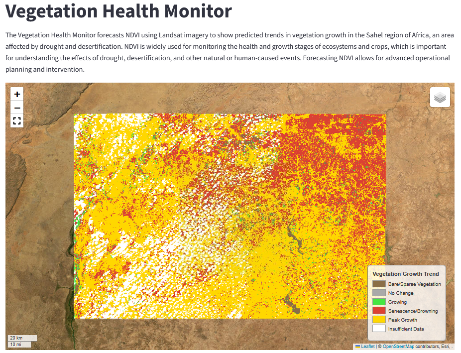

# Vegetation Health Monitor

The Vegetation Health Monitor forecasts NDVI using Landsat imagery to show predicted trends in vegetation growth for an area in the Sahel region of Africa. NDVI is widely used for monitoring the health and growth stages of ecosystems and crops, which is important for understanding the effects of drought, desertification, and other natural or human-caused events. Forecasting NDVI allows for advanced operational planning and intervention.

This system contains the following components, each a separate containerized application orchestrated using AWS Step Functions, which runs every 8 days.

- Data ingest: This first step searches a STAC collection for any new Landsat data in the specified region since the last run, downloads the data, masks clouds, computes NDVI, creates an 8 day maximum-value composite (MVC), fills missing data, and adds the result to a Zarr store.
- Forecasting model: After new data is processed, an LSTM Seq2Seq model uses prior NDVI values to predict NDVI for the next 3 timesteps, or 24 days into the future.
- Growth trend classification: Using recent NDVI observations and the latest forecast, the recent and predicted NDVI trends are determined for each pixel, and Cloud-Optimized GeoTiffs (COGs) are generated for visualization. Each pixel is classified as one of the following categories:

    1) Bare/Sparse Vegetation
    2) No Change
    3) Growing
    4) Senescence/Browning
    5) Peak Growth
    6) Insufficient Data

The recent and predicted NDVI trends are shown on a map in a Streamlit web application.

#### To Do:

There are a number of things that could be done to keep building out and enhancing each component of the project. Some of these are:
- Add other inputs to the forecasting model such as temperature and precipitation data.
- Use a longer lookback window and more years of historical data for training the model.
- Landsat data is currently resampled to 300 m spatial resolution to speed up processing during development. Change this to use the full 30 m resolution.
- Add tests.
- Use advanced filtering and gap filling techniques for the satellite imagery.
- Mask water bodies and urban areas.